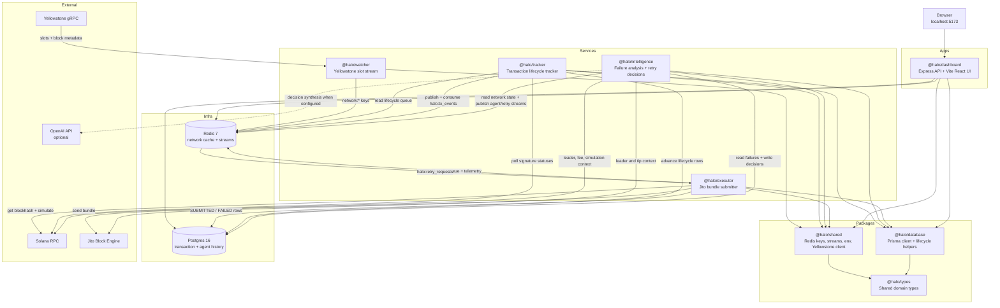
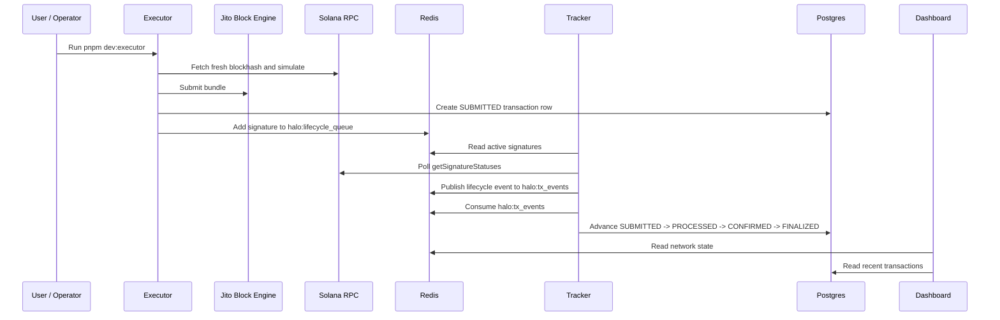
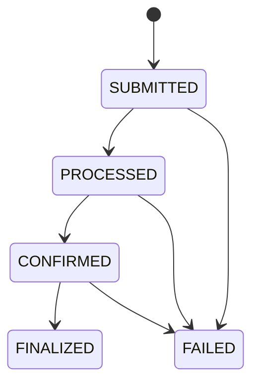
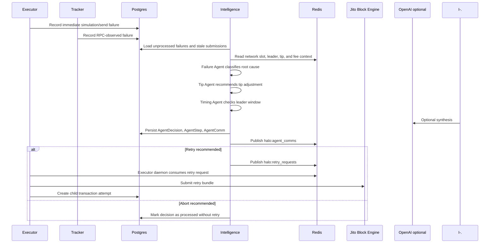
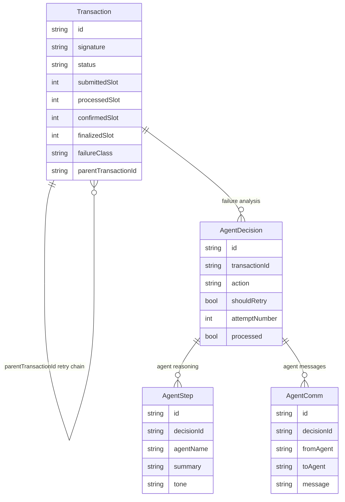
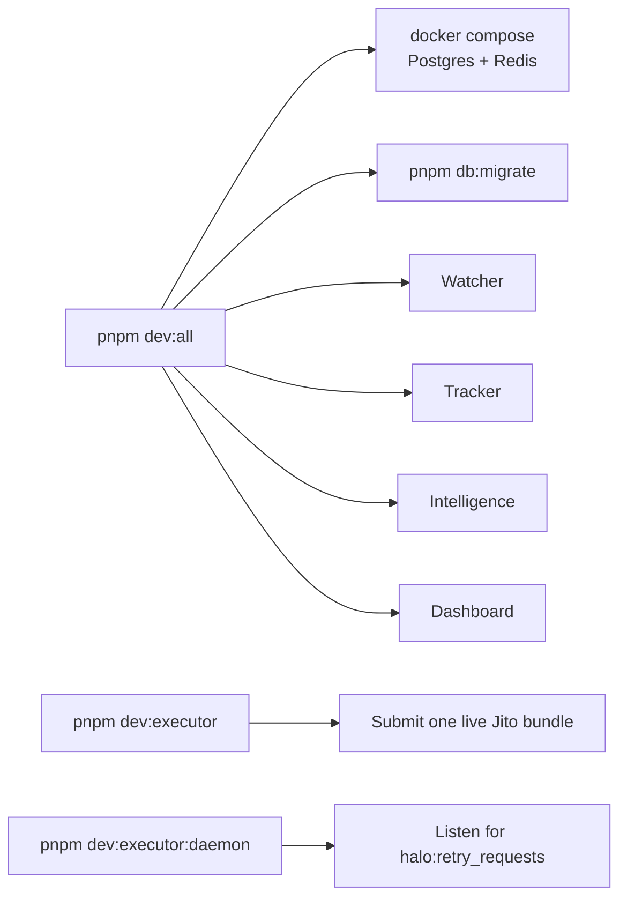

# HALO Architecture

HALO is a Solana network observer and Jito bundle execution tracker. It watches live network state, submits bundles, tracks their lifecycle, and runs an agent pipeline when bundles fail or stall.

## System Overview

## Component Responsibilities

| Component | Path | Responsibility |
| --- | --- | --- |
| Dashboard | `apps/dashboard` | Serves the React UI and API endpoints. Reads live Redis state, transaction rows, and agent history for the dashboard. |
| Watcher | `services/watcher` | Owns the Yellowstone gRPC connection and writes live slot/block metadata into Redis. |
| Tracker | `services/tracker` | Tracks submitted signatures through Solana commitments and writes lifecycle transitions to Postgres. |
| Intelligence | `services/intelligence` | Detects failed/stalled bundles, runs failure/tip/timing agents, records decisions, and publishes retry requests. |
| Executor | `services/executor` | Builds and submits Jito bundles. In daemon mode, consumes retry requests and resubmits child attempts. |
| Shared | `packages/shared` | Defines Redis keys, streams, consumer groups, queue helpers, env helpers, and shared service adapters. |
| Database | `packages/database` | Owns the Prisma schema, generated client, and lifecycle persistence helpers. |
| Types | `packages/types` | Defines shared transaction, network, failure, retry, and agent types. |

## Happy Path

The normal transaction status path is:

## Failure And Retry Path

## Redis Contract

| Key or Stream | Type | Writer | Reader | Purpose |
| --- | --- | --- | --- | --- |
| `network:current_slot` | Key | Watcher | Dashboard, Intelligence | Latest observed Solana slot. |
| `network:slot_meta` | Key | Watcher | Dashboard, Intelligence | Latest block metadata snapshot. |
| `network:current_leader` | Key | Intelligence | Dashboard, Intelligence | Current or inferred slot leader. |
| `network:next_jito_leader_*` | Keys | Executor, Intelligence | Dashboard, Intelligence, Executor | Next Jito leader timing context. |
| `network:recommended_submit_slot` | Key | Executor, Intelligence | Dashboard, Executor | Suggested submission slot. |
| `network:recommended_tip` | Key | Intelligence | Dashboard, Executor | Agent-recommended Jito tip. |
| `network:median_priority_fee` | Key | Executor, Intelligence | Dashboard, Intelligence | Fee telemetry used by tip decisions. |
| `halo:lifecycle_queue` | Hash | Executor, Dashboard wallet test | Tracker | Active signatures waiting for lifecycle resolution. |
| `halo:tx_events` | Stream | Tracker | Tracker | Lifecycle promotion events persisted into Postgres. |
| `halo:agent_comms` | Stream | Intelligence | Dashboard | Agent messages for the swarm and reasoning views. |
| `halo:retry_requests` | Stream | Intelligence | Executor daemon | Retry commands for failed or stalled bundles. |

## Persistent Data

Postgres is the durable audit log for bundle attempts and agent decisions. Redis is the live coordination layer for network state, lifecycle queues, agent messages, and retry requests.

## Local Runtime

`pnpm dev:all` intentionally does not start the executor because the executor can submit real Jito bundles and spend SOL. Run `pnpm dev:executor` or `pnpm dev:executor:daemon` only when the wallet and environment are ready.

## End-To-End Flow

1. Watcher streams live Solana slot data from Yellowstone into Redis.
2. Executor submits a Jito bundle, writes a `SUBMITTED` transaction row, and puts its signature in the Redis lifecycle queue.
3. Tracker polls Solana RPC for active signatures, emits lifecycle events, and persists status changes to Postgres.
4. Dashboard reads Redis and Postgres to show network health, recent transactions, and agent activity.
5. Intelligence looks for failures and stale submissions, classifies the cause, computes tip and timing changes, and records the agent reasoning.
6. If retry is recommended, Intelligence publishes a retry request and the executor daemon submits a new child attempt.
