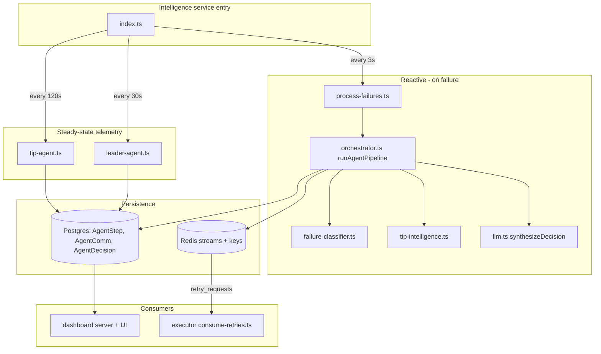

# Agent Pipeline

HALO models its agents as orchestration functions inside the `@halo/intelligence` service rather than as long-lived `Agent` class instances. The service runs scheduled ticks, records agent steps and communications, and publishes retry requests when the final decision says a bundle should be resubmitted.

## High-Level Flow

## Where Agents Start

`services/intelligence/src/index.ts` is the entry point for the agent runtime. It creates three non-overlapping scheduled ticks:

- `processPendingFailures(redis)` runs every 3 seconds and triggers the reactive failure pipeline.
- `refreshTipTelemetry(redis)` runs on `TIP_AGENT_INTERVAL_MS`, defaulting to 120 seconds.
- `refreshLeaderTelemetry(redis)` runs on `LEADER_AGENT_INTERVAL_MS`, defaulting to 30 seconds.

These ticks are the closest thing to "agent creation" in this codebase. Agents are not instantiated with `new Agent()` or `Agent.create()`; they are named pipeline roles recorded through `AgentStep`, `AgentComm`, and `AgentDecision` rows.

## Reactive Failure Pipeline

`services/intelligence/src/process-failures.ts` loads stale submissions and failed transactions that have not yet been processed by the agents. Each unprocessed failure is passed into `runAgentPipeline(redis, transaction)` in `services/intelligence/src/orchestrator.ts`.

The orchestrator runs the core agent sequence:

| Step | Agent | Main code path | Responsibility |
| --- | --- | --- | --- |
| 1 | Failure Agent | `failure-classifier.ts` | Classifies the failure as `BLOCKHASH_EXPIRED`, `TIP_TOO_LOW`, `LEADER_SKIPPED`, `BUNDLE_REJECTED`, `COMPUTE_EXCEEDED`, or `UNKNOWN`. |
| 2 | Tip Agent | `tip-intelligence.ts` | Recommends a dynamic tip using priority-fee and optional Jito tip-account signals. |
| 3 | Timing Agent | `orchestrator.ts` + `jito-searcher.ts` | Reads the next Jito leader window and decides whether retry timing should hold or submit now. |
| 4 | Halo / Aggregator | `llm.ts` | Synthesizes the final action with OpenAI when configured, otherwise falls back to deterministic heuristics. |
| 5 | Retry Executor | `orchestrator.ts` + Redis | Publishes a retry request to `halo:retry_requests` when the decision allows another attempt. |

## Steady Telemetry Agents

The steady-state agents keep the dashboard and Redis cache fresh even when no bundle is currently failing.

`services/intelligence/src/tip-agent.ts` records Tip Agent telemetry. It writes `recommendedTip`, `networkMedianPriorityFee`, and `tipAccountActivity` into Redis, then records communications such as `tip_ext -> tip_int` and `tip_int -> aggregator`.

`services/intelligence/src/leader-agent.ts` records Leader Agent telemetry. It resolves the current slot leader, fetches the next Jito leader schedule, writes leader keys into Redis, and records communications such as `leader_ext -> leader_int`, `leader_int -> timing`, and `leader_int -> aggregator`.

## Persistence And Streams

The persistence helpers live in `packages/database/src/lifecycle.ts`:

- `saveAgentStep()` writes the vertical reasoning chain shown by `AgentFlow`.
- `saveAgentComm()` writes swarm graph messages shown by `AgentSwarm`.
- `saveAgentDecision()` writes the final retry or abort decision.
- `markAgentProcessed()` prevents the same failed transaction from being processed repeatedly.

Redis is used for live state and handoffs:

- Network and recommendation keys are stored under `REDIS_KEYS`.
- Agent communications are published with `publishAgentComm()`.
- Retry requests are published with `publishRetryRequest()` to the `halo:retry_requests` stream.

## Consumers

The dashboard consumes persisted agent state in `apps/dashboard/src/server.ts` through `getLatestAgentFlow()`, `getRecentAgentComms()`, and `getLatestAgentDecision()`. The UI renders that data through `apps/dashboard/src/components/AgentSwarm.tsx` and `apps/dashboard/src/components/AgentFlow.tsx`.

The executor consumes retry requests in daemon mode. `services/executor/src/index.ts` starts `startRetryConsumer()` from `services/executor/src/consume-retries.ts`, which reads `halo:retry_requests` and resubmits bundles with the agent-recommended action and tip.

## Related Diagram

Open `docs/Agent Pipeline.drawio.xml` in diagrams.net or Cursor's Draw.io integration for the editable system diagram.
